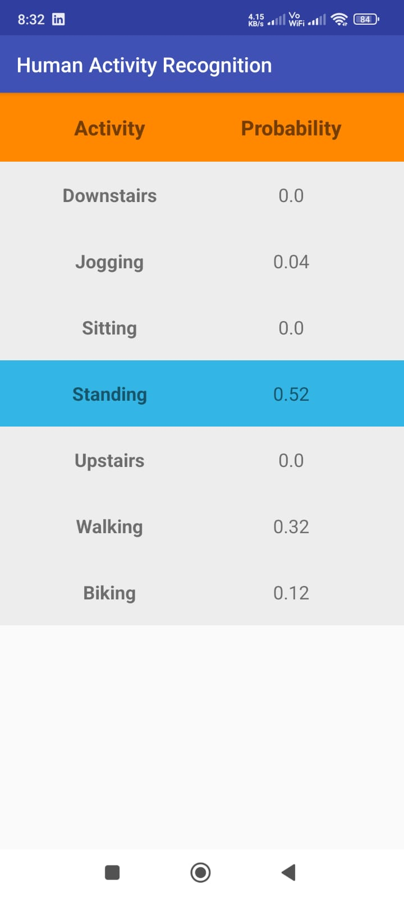

# Human Activity Recognition Using Federated Learning

The primary aim of this project is to develop a federated learning (FL)-based HAR system that
leverages the computational resources of edge devices (smartphones and wearables) to perform
local data processing. By doing so, the project seeks to preserve the privacy of the users' sensor
data and reduce the dependency on centralized server infrastructure. This approach aims to achieve
comparable or superior accuracy in activity recognition tasks without compromising on privacy
and scalability.

